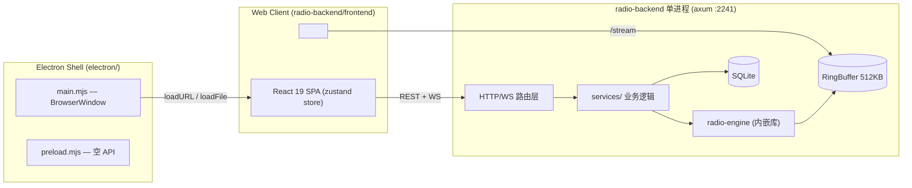

# ARCHITECTURE — RakurakuMusicWorld

> 本文记录**当前真实架构**，全部结论来自实际代码（file:symbol 标注）。
> 目标架构（Logical Side / Physical Side 分离）只在 MIGRATION.md 中描述，未实现。
>
> 状态标记：**[Existing]** 已存在｜**[Partial]** 部分存在，有缺口｜**[Missing]** 不存在｜**[Needs Refactor]** 存在但结构阻碍目标架构

---

## 1. 当前总体形态



- 单进程单端口：`radio-backend` 同时服务 REST `/api`、WebSocket `/ws`、音频 `/stream`、静态前端（`routes/mod.rs:build_router`）。
- Electron 只是壳：创建窗口、加载 URL、生命周期。无 Node 集成（`contextIsolation: true, nodeIntegration: false, sandbox: true`，`electron/main.mjs` webPreferences）。
- **没有** Logical/Physical Side 分离；"世界状态"（播放、队列、听众）散布在 engine 内部状态、`AppState` 字段、SQLite 三处。

## 2. 分层现状对照

### 2.1 Client（前端 + 桌面壳）

| 组件 | 位置 | 状态 | 说明 |
| --- | --- | --- | --- |
| UI | `frontend/src/pages/`、`components/` | [Existing] | 播放器 / 曲库 / 设置 三页（`router.tsx`），管理面板内嵌在 Settings |
| Client State | `frontend/src/store.ts` (zustand) | [Needs Refactor] | 单 store 混合了服务器状态镜像（playback/queue/listeners）、本地 UI 状态（volume/accent/toast）、本地持久化（favorites 走 localStorage，`store.ts:toggleFavorite`） |
| Network | `api/client.ts`、`api/index.ts`、`api/ws.ts` | [Existing] | REST 包装解包 + WS 分发；`applyPlaybackState` / `applyQueueUpdate` 直写 store |
| Audio 输出 | `audio/streamAudio.ts` | [Existing] | 单例 `<audio>` → `/stream`；切歌重连（`?r=` nonce）、指数退避、停滞看门狗 |
| 位置平滑 | `hooks/usePlaybackClock.ts` | [Existing] | 用 `position_ms + (Date.now() - timestamp_ms)` 客户端外推；**这是 World Clock 思路的雏形，但时间基准是墙钟而非服务器时钟** |
| 桌面壳 | `electron/main.mjs` | [Existing] | 窗口 1440×900（双栏 xl 断点需要 ≥1280 CSS px）、外部链接走系统浏览器 |
| Preload API | `electron/preload.mjs` | [Existing]（空） | 无任何 contextBridge 暴露 |

### 2.2 服务端（radio-backend）

| 组件 | 位置 | 状态 | 说明 |
| --- | --- | --- | --- |
| 路由/HTTP 适配 | `routes/` | [Existing] | 纯适配层：解析请求 → 调 service → JSON 响应。无业务逻辑内嵌（除 `station.rs` 的 URL 组装） |
| 播放状态权威 | `radio-engine/src/player.rs` | [Needs Refactor] | `PlaybackState` 由 engine 每 500ms 发布（`player.rs:publish_state`）；**这是事实上的 PlaybackState 权威，但被埋在音频引擎里** |
| 队列权威 | `services/queue.rs` + `queue_items` 表 | [Needs Refactor] | DB 是 pending 队列的权威；engine 内部还有第二个"请求队列"（`Player::enqueue_request`），两套队列靠 `queue_sync` 互斥锁 + `rehydrate_engine_queue` 手工同步 |
| 听众注册 | `app/state.rs:listeners` (DashMap) | [Existing] | 内存态，WS 连接注册 / 断开移除，不持久化 |
| WS 广播 | `services/playback_broadcast.rs` + `websocket.rs` | [Existing] | 500ms 轮询 engine → enrich → broadcast；心跳 ping/pong（30s/60s 超时，`websocket.rs:handle_socket`） |
| 歌词快照缓存 | `services/playback_snapshot.rs` | [Existing] | 切歌时解析 .lrc（GBK/UTF-16 容错），全量帧缓存于 `AppState.ws_full_snapshot` 供新连接补发 |
| 持久化 | `db.rs` + `migrations/001..009` | [Existing] | users/songs/playlists/queue_items/play_history/admin_log/favorites/user_requests/ncm_import_tasks/metadata_jobs |
| 配置 | `config.rs` + `config.toml` | [Existing] | `POST /api/admin/settings` 原子写回 config.toml（`routes/admin/settings.rs:write_config_atomically`），**不热加载** |

### 2.3 音频引擎（radio-engine）

| 组件 | 位置 | 状态 | 说明 |
| --- | --- | --- | --- |
| 播放主循环 | `player.rs:run()` | [Existing] | request 优先、folder cycle 兜底；命令经 `AudioCommandType`（Skip/Next/Prev/Play/Stop/ReloadQueue） |
| 状态发布 | `player.rs:publish_state` | [Existing] | 500ms 节流，`PlaybackState{playlist_index, file_path, position_ms, duration_ms, status, track_start_timestamp_ms, song_id, ...}`（`types.rs:70`） |
| 音频管道 | `player.rs:stream_track` | [Existing] | ffmpeg 子进程 decode→libmp3lame 128k→stdout→RingBuffer |
| 环形缓冲 | `ring_buffer.rs` | [Existing] | 单写多读，`clear_and_resync_readers()` 实现切歌时直播边缘重同步 |

## 3. 控制流：一次"切歌"的实际路径

```
Admin UI → POST /api/admin/playlist/next (routes/admin/playback.rs)
        → services/queue.rs:skip_current()   [DB: playing→played, 取下一个 pending]
        → PlayerHandle::send_command(Skip)   [跨线程 channel]
        → player.rs:run() 消费命令, stream_track 结束
        → ring_buffer.clear_and_resync_readers()  [/stream 客户端连接被关闭]
        → 客户端 <audio> ended → streamAudio.reconnect() 回直播边缘
        → player.rs:publish_state → playback_broadcast 500ms 轮询
        → playback_snapshot.build_message (歌词全量帧)
        → ws_tx.broadcast → websocket.rs:handle_socket → 浏览器 store.applyPlaybackState
```

结论：命令路径（Command）与状态广播（Event/State）已经天然分离，但没有命名成 Command/Event，也没有统一入口。

## 4. 映射到目标架构：抽取候选

| 现有模块 | 目标角色 | 判定 |
| --- | --- | --- |
| `radio-engine::types::PlaybackState` + `player.rs` 状态发布 | World 的 PlaybackState | [Needs Refactor] 从 engine 提升为 World 状态；engine 降级为"音频输出执行器" |
| `services/queue.rs` + `queue_items` 表 | World 的 PlaylistState + 命令处理（AddTrack/RemoveTrack/Reorder） | [Needs Refactor] 与 engine 内请求队列二选一归一 |
| `services/playback_broadcast.rs` + `playback_snapshot.rs` | Event 派发 + Snapshot 生成 | [Partial] 事件只有 playback_state 一种主类型，缺 TrackChanged/PlayerJoined 等判别 |
| `auth.rs`（device identity）+ `state.rs:listeners` | World 的 Player（身份/在线） | [Existing] 概念已存在，缺 worldId 维度 |
| `models/ws.rs:WsMessage` | Protocol 层 | [Needs Refactor] 内嵌 URL/歌词等富数据，UI 直接消费服务器格式 |
| `http/stream.rs` + `ring_buffer.rs` | Physical Side 的音频传输细节 | [Existing] 应整体留在 Physical Side |
| `config.rs` + `config.toml` | World metadata/persistence 的雏形 | [Partial] 单机配置，无 world identity |
| `websocket.rs:handle_socket` ping/pong + `usePlaybackClock` | World Clock | [Partial] 有 timestamp 同步雏形，无 offset/延迟估计 |

## 5. 明确的边界（不要动的部分）

- `RingBuffer` 容量必须 2 的幂（524288）；`/stream` 背压依赖有界 channel。
- `/stream` 切歌关连接、前端 `ended` 重连——这是直播流的正确语义，迁移时保持。
- 歌词三态（`[]`/`null`/数组）是前端强依赖契约。
- ffmpeg 管道与 keepalive bind（`bootstrap.rs:bind_with_keepalive`）是运维稳定性关键。
