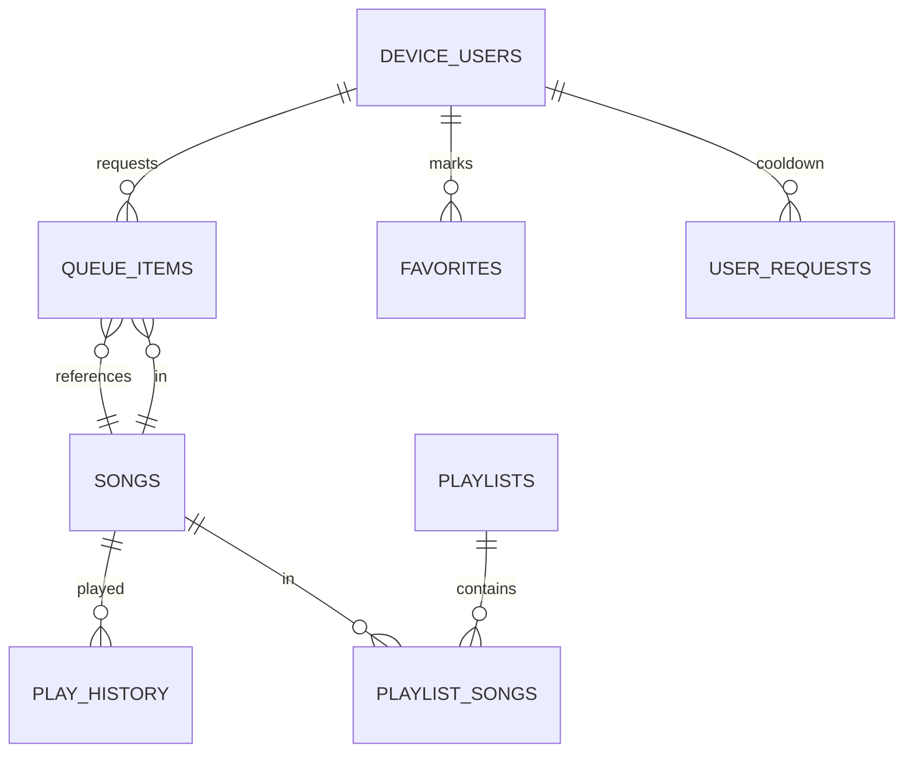

# WORLD MODEL — 现状映射

> 只描述**当前代码中真实存在**的实体与关系，并标注它们与目标 World 模型的对应关系。
> 所有字段列表摘自实际类型定义（file:symbol）。

---

## 1. 现有实体 → World 概念映射

| 目标概念 | 现有对应物 | 位置 | 状态 |
| --- | --- | --- | --- |
| World | 整个后端进程 + config.toml（隐式单例） | `radio-backend/src/main.rs` | [Missing] 无显式 World 实体、无 worldId |
| World identity | 电台名/短名（`station.name`, `station.short_name`） | `config.rs:210-215`, `app/state.rs:station` | [Partial] 有展示用身份，无稳定可迁移 ID |
| Player | `DeviceUser`（device_token → 用户） | `auth.rs:AuthUser`, `device_users` 表 | [Existing] 设备即玩家；角色 admin/user（`auth.rs:require_admin`） |
| Playback State | `PlaybackState` | `radio-engine/src/types.rs:70` | [Existing] 但权威在引擎内部 |
| Playlist State | `queue_items` 表 + engine 请求队列 | `services/queue.rs`, `player.rs:enqueue_request` | [Needs Refactor] 双份队列需归一 |
| Track | `Song`（DB 元数据）+ 磁盘音频文件 | `songs` 表, `models/mod.rs` | [Existing] 元数据/资源已分离：DB 存 `file_path`（相对 media_path），文件在磁盘 |
| Permission | 角色 admin/user + 管理员令牌提权 | `auth.rs`, `routes/auth.rs:claim-admin` | [Existing] 粗粒度但可用 |
| Persistence | SQLite（sqlx 迁移 001–009） | `db.rs`, `migrations/` | [Existing] 单机文件存储 |
| Player 会话 | `OnlineListener`（WS 连接注册表） | `app/state.rs:13`, `websocket.rs:79-93` | [Partial] 内存态，进程重启即失 |

## 2. PlaybackState 权威字段（当前实现）

摘自 `radio-engine/src/types.rs:69-92`：

```rust
pub struct PlaybackState {
    pub playlist_index: i64,        // play_queue 下标；请求曲目为 -1
    pub file_path: String,          // 相对 media_root
    pub position_ms: i64,
    pub duration_ms: i64,
    pub status: PlaybackStatus,     // Playing | Stopped | Crossfading
    pub total_bytes_sent: u64,
    pub track_start_timestamp_ms: i64,  // 系统墙钟 ms — World Clock 雏形
    pub title: String,
    pub artist: String,
    pub song_id: Option<i64>,       // DB 主键；folder-cycle 曲目为 None
}
```

发布节奏：`player.rs:publish_state` 每 500ms（`STATE_PUBLISH_INTERVAL_MS`）；空闲时 `publish_idle()` 发布 Stopped。

**缺口**（对照目标模型）：
- 无 `started_at`/`paused_at` 语义对（暂停未实现——本地 pause 只是客户端静音，`streamAudio.ts:pauseAudio`）。
- 无 seek 命令（`AudioCommandType` 只有 Skip/Next/Prev/Play/Stop/ReloadQueue，`types.rs:128`）。
- `position_ms` 是引擎自算的墙钟流逝，客户端用 `Date.now()` 外推（`usePlaybackClock.ts:25-27`）——同一纪元假设成立，但无延迟补偿。

## 3. 队列（Playlist）现状

**DB 侧**（权威）：`queue_items` 表（`migrations/001`, `005`）：

```
queue_items: id, song_id, device_user_id, status(pending|playing|played), position, added_at, played_at
```

操作（`services/queue.rs`）：
- `add_to_queue` — 限流（3 次/300s）+ 冷却（60s）检查后入库，推送 `RequestedTrack` 到引擎
- `move_queue_item` / `remove_queue_item` / `skip_current` — 管理员操作，持 `queue_sync` 锁
- `rehydrate_engine_queue`（`queue.rs:430`）— 启动时把 pending 重灌入引擎请求队列（重启续播）
- `mark_playing`（`queue.rs:405`）— 引擎开播时回写状态（engine→DB 回调）

**引擎侧**（镜像）：`player.rs` 内 `request_queue: Vec<RequestedTrack>`（`types.rs:114`：file_path, song_id, title, artist, duration_ms）。

**双队列问题**：同一逻辑队列存两份（DB + 引擎内存），靠 `queue_sync` 互斥 + 手工 rehydrate 同步。目标架构应归一为 World PlaylistState 单一权威。

## 4. Track 现状

`songs` 表（`migrations/001`）：id, title, artist, album, genre, year, duration_ms, file_path, lyrics_path, cover_path, filesize, created_at, metadata_source…

- 元数据与资源分离 ✅：DB 存相对路径，音频/歌词/封面在磁盘（`media_path` 下）。
- `SongSummary` DTO（`models/mod.rs`）用于嵌入队列/搜索响应，`has_lyrics`/`has_cover` 为派生字段。
- 播放只经 `file_path` → ffmpeg；**不存在**远程/缓存 Track Resource（NCM 下载是入库流程，产物仍是本地文件）。

## 5. Player 现状

- 身份：`device_token`（UUIDv4，httpOnly Cookie，`http/middleware.rs:device_cookie_middleware`）；首次访问由 `auth.rs:ensure_device_user` 建行。
- 显示名：1–32 字符，`POST /api/auth/name`。
- 在线判定：WS 连接存活（`websocket.rs:handle_socket` 注册/注销 + `listeners_update` 广播）。
- 权限：`role` 字段（admin/user）；提权走 `admin_setup_token`（config 注入，`POST /api/auth/claim-admin`）。
- **无跨 World 概念**：一个设备用户只属于唯一隐式 World。

## 6. Command / Event / State 现状

| 目标 | 现有 | 位置 | 缺口 |
| --- | --- | --- | --- |
| Command | `AudioCommand{cmd_type, song_id, file_path}`（engine 内）+ REST 动作（POST /api/queue, /api/queue/:id/move…） | `types.rs:139`, `routes/queue.rs` | 命令分两路：engine 命令与 DB 动作，无统一 Command 层 |
| Event | `WsMessage` 5 变体：PlaybackState / QueueUpdate / Notice / Ping / ListenersUpdate | `models/ws.rs:16` | QueueUpdate 是通知不是状态（前端收到后**回查 REST**，`store.ts:applyQueueUpdate`）；无 TrackChanged 等细粒度事件 |
| State | PlaybackState（WS 500ms）+ REST 快照（/api/now-playing, /api/queue） | `playback_broadcast.rs` | 无 Join 时的全量 Snapshot 语义（只有歌词全量帧补发，`websocket.rs:112-127`） |

## 7. 关系图（现状）



播放历史 `play_history` 由 `mark_playing` 写入（每个请求曲目）；folder-cycle 曲目不入史。

## 8. 目标 World 容器草图（仅示意，非实现）

目标模型要求 World 至少包含：identity / metadata / playback / playlist / tracks / players / permissions / persistence。当前代码中这些概念的"安身之处"：

| World 组成 | 现在住在哪里 | 迁移终点（MIGRATION.md 展开） |
| --- | --- | --- |
| identity | config.toml `[station]` | WorldStorage 元数据 |
| playback | engine `PlaybackState` | World State 权威 |
| playlist | `queue_items` + engine request_queue | World State 权威（单份） |
| tracks | `songs` 表 + 磁盘 | Track Registry（不变） |
| players | `device_users` + `listeners` DashMap | Player Registry + 会话 |
| permissions | role 字段 | 不变（第一阶段） |
| persistence | sqlx migrations | WorldStorage 抽象后端 |
